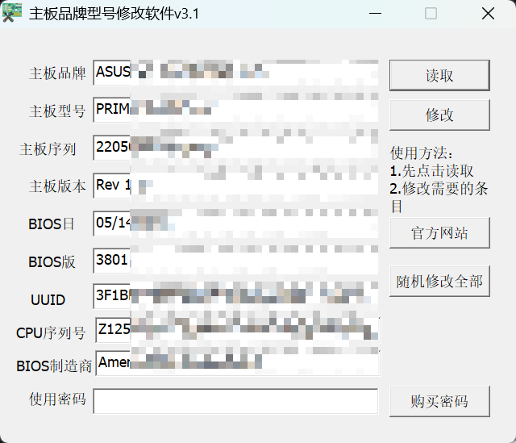

# DMIEdit v5.27 Patched / 电脑主板型号修改软件v3.1



---

> **CN / EN:** Chinese and English translations in this document are AI-generated (machine translation). For accuracy, refer to the Japanese version.
> **CN / EN:** 本文档中的中文和英文翻译为 AI 生成（机器翻译）。如需准确内容，请参考日文原文。

---

## 概要 / Overview / 概述

**JP:** AMI DMIEdit v5.27 をベースとしたマザーボード DMI/SMBIOS 情報編集ツールです。第三者の配布パッケージに組み込まれていたパスワード認証および日付チェックをバイパスするパッチを適用しています。

**EN:** This is a motherboard DMI/SMBIOS editing tool based on AMI DMIEdit v5.27. We have applied patches to bypass the password authentication and date-check protection added by a third-party repackager.

**CN:** 本工具基于 AMI DMIEdit v5.27 的 DMI/SMBIOS 主板信息编辑软件。已应用补丁绕过第三方打包者添加的密码验证和日期检查保护。

---

## ファイル構成 / File Structure / 文件结构

| ファイル名 / File / 文件名 | 説明 / Description / 说明 |
|-----------|-------------------|
| `电脑主板型号修改软件v3.1.exe` | パッチ済み実行ファイル / Patched executable / 已打补丁的可执行文件 |
| `AMIBCP 5.02.0031.exe` | AMIBCP ユーティリティ (同梱) / AMIBCP utility |
| `RunAsDate.exe` | 日付偽装ツール (NirSoft 製) / Date faker / 日期伪造工具 |
| `launcher.ps1` | ワンクリック起動スクリプト / One-click launcher / 一键启动脚本 |
| `V3.1.png` | プレビュー画像 / Preview image / 预览图片 |

---

## 使用方法 / Usage / 使用方法

### Option A: ランチャー使用（推奨）/ Using Launcher (recommended) / 使用启动器（推荐）

**JP:**
1. `launcher.ps1` を右クリック → **PowerShell で実行**
2. 管理者権限がない場合は自動的に UAC 昇格を要求します
3. RunAsDate によりシステム日付を 2022/01/01 に偽装した状態でプログラムが起動します
4. パスワード `764443039` を入力してログイン

**EN:**
1. Right-click `launcher.ps1` → **Run with PowerShell**
2. Auto-elevates to admin if needed (UAC prompt)
3. Launches with date faked to 2022/01/01 via RunAsDate
4. Enter password `764443039` to login

**CN:**
1. 右键 `launcher.ps1` → **使用 PowerShell 运行**
2. 如无管理员权限，会自动请求 UAC 提权
3. RunAsDate 将系统日期伪造为 2022/01/01 后启动程序
4. 输入密码 `764443039` 登录

### Option B: 手動起動 / Manual Launch / 手动启动

**JP:**
1. `电脑主板型号修改软件v3.1.exe` を右クリック → **管理者として実行**
2. パスワード `764443039` を入力
3. DMI / SMBIOS 編集画面が開きます

**EN:**
1. Right-click `电脑主板型号修改软件v3.1.exe` → **Run as Administrator**
2. Enter password: `764443039`
3. Edit DMI / SMBIOS information

**CN:**
1. 右键 `电脑主板型号修改软件v3.1.exe` → **以管理员身份运行**
2. 输入密码 `764443039`
3. 打开 DMI/SMBIOS 编辑界面

---

## 解析レポート / Reverse Engineering Report / 逆向分析报告

> **JP:** 以下は本パッチの制作過程を詳細に記録した技術レポートです。解析にはバイナリエディタ（HxD）と静的解析ツールを使用しています。
>
> **EN:** This is a technical report documenting the patch development process in detail. Analysis was performed using HxD (hex editor) and static analysis tools.
>
> **CN:** 以下是制作此补丁的详细技术记录。分析使用二进制编辑器（HxD）和静态分析工具。

---

### Phase 1: 初期調査 / Initial Reconnaissance / 初步调查

**JP:**
配布されていたファイルは `7z SFX` (Self-Extracting Archive) 形式でした。展開後の実行ファイルを `DIE` (Detect It Easy) および `ExeInfoPE` でスキャンしたところ、**VMProtect** によるプロテクションが適用されていることが判明しました。

さらに内部のリソースを調査した結果、このソフトウェアは **AMI DMIEdit v5.27** というオリジナルツールに、第三者がパスワード認証モジュールを追加したものであることが分かりました。

確認された内部文字列:
- 内部モジュール名: `captobin.exe`
- コンパイラ: Borland C++Builder / Delphi VCL
- パスワードダイアログクラス: `TFormPassDialog`

**EN:**
The distributed file was a `7z SFX` (Self-Extracting Archive). After extraction, we scanned the executable with **DIE** (Detect It Easy) and **ExeInfoPE**, revealing **VMProtect** obfuscation.

Resource analysis identified this as **AMI DMIEdit v5.27** with a third-party password protection layer added on top.

Key internal strings found:
- Internal module name: `captobin.exe`
- Compiler: Borland C++Builder / Delphi VCL
- Password dialog class: `TFormPassDialog`

**CN:**
分发文件为 `7z SFX`（自解压存档）格式。解压后使用 `DIE`（Detect It Easy）和 `ExeInfoPE` 扫描可执行文件，发现应用了 **VMProtect** 保护。

进一步分析内部资源后发现，该软件是 **AMI DMIEdit v5.27** 原版工具加上第三方添加的密码验证模块。

已确认的内部字符串:
- 内部模块名: `captobin.exe`
- 编译器: Borland C++Builder / Delphi VCL
- 密码对话框类: `TFormPassDialog`

---

### Phase 2: 保護機構の特定 / Identifying the Protection / 定位保护机制

**JP:**
`TFormPassDialog` の VCL メソッドテーブルをダンプし、以下のイベントハンドラを特定しました:

| Method | Address (RVA) |
|--------|--------------|
| `btnOKClick` | `0x0057D720` |
| `btnCancelClick` | `0x0057D718` |
| `FormCreate` | `0x0057D7DC` |
| `FormClose` | `0x0057D7A0` |
| `edtPwdKeyPress` | `0x0057D958` |
| `FormKeyPress` | `0x0057D974` |
| `Button2Click` | `0x0057D798` |
| `WndProc` | `0x0057C7D4` |

これらすべてのメソッドは VMProtect のオーバーレイ領域（ファイルサイズ 4.45MB のうち、PE セクション終端以降の領域）に配置されていました。そのため、実行コードへの直接パッチは困難と判断しました。

次に、メッセージ文字列テーブルを調査しました。オフセット `0x17CA5C` ～ `0x17CD20` に、UTF-16LE 形式で以下のエラーメッセージが格納されていました:

| 文字列 / String | オフセット / Offset | 意味 / Meaning |
|--------|-----------|------|
| `无权运行本程序` | `0x17CA70` | 実行権限なし / No right to run |
| `不允许运行的时段` | `0x17CA8C` | 許可されていない時間帯 / Time period not allowed |
| `超过允许运行的日期` | `0x17CAAC` | 期限切れ / Date limit exceeded |
| `密码错误` | `0x17CAEC` | パスワードエラー / Password error |
| `没有发现加密记录` | `0x17CB04` | 暗号化レコードなし / No encryption record |

このことから、認証にはパスワード照合だけでなく、**日付/時間のチェック**も存在することが明らかになりました。

**EN:**
We dumped the VCL method table of `TFormPassDialog` and identified the event handlers listed above. All methods reside in the **VMProtect overlay region** (beyond the PE section boundary), making direct code patching infeasible.

Next, we examined the string table at offset `0x17CA5C`–`0x17CD20`, which contained UTF-16LE encoded error messages. This revealed that the authentication involves **both password verification AND date/time authorization checks**.

**CN:**
我们导出了 `TFormPassDialog` 的 VCL 方法表，确定了如上所示的事件处理函数。所有方法都位于 **VMProtect 叠加区域**（PE 节区边界之后的部分），因此直接修改执行代码非常困难。

接下来检查了消息字符串表。在偏移 `0x17CA5C`～`0x17CD20` 处，以 UTF-16LE 格式存储了上述错误消息。

由此可以确定，认证不仅包含密码验证，还包含**日期/时间检查**。

---

### Phase 3: MD5 ハッシュ解析 / MD5 Hash Analysis / MD5 哈希分析

**JP:**
パスワードの検証ロジックを解析するため、認証に関連するデータを探索しました。その結果、以下の構造体を発見しました:

```
Offset 0x43F148:
  09                   ; 長さ (9)
  42 41 43 41 41 44 47 4E 44  ; "BACAADGND" (ソルト/キー識別子)
  00 00 00 00 00 00    ; パディング (6 bytes)
  20                   ; スペース区切り
  45 44 33 39 37 36 37 43  ; "ED39767C" ← MD5 ハッシュ値 (ASCII Hex)
  38 33 41 46 31 43 31 45  ; "83AF1C1E"
  38 30 37 31 45 33 45 44  ; "8071E3ED"
  33 34 43 38 30 38 44 43  ; "34C808DC"
  00 00                ; ヌル終端
```

この構造から、プログラムは以下の手順で認証を行っていると推測しました:

1. ユーザーがパスワードを入力
2. `CMd5A` クラス（独自の MD5 実装）でハッシュ値を計算
3. 計算結果と `0x43F159` に格納された 32 バイトの ASCII ハッシュ値を比較
4. 一致すれば認証成功 → 日付チェックへ進む
5. 一致しなければエラーダイアログを表示

`BACAADGND` はソルト（鍵識別子）として使用されている可能性が高いと考えられます。

> **注:** 本来のオフセットは `0x43F159` ですが、最初のパッチでは `0x43F158` から書き込んでしまい、1 バイトの位置ズレが発生していました。このため最初のテストでは期待通り動作しませんでした。

**EN:**
We searched for authentication-related data and discovered the structure shown above. The program likely:

1. Accepts user password input
2. Computes MD5 hash via the `CMd5A` class (custom MD5 implementation)
3. Compares the result against the 32-byte ASCII hex hash stored at `0x43F159`
4. On match → proceeds to date/time check
5. On mismatch → shows error dialog

`BACAADGND` is likely used as a salt or key identifier.

> **Note:** The actual hash begins at `0x43F159`, but our initial patch wrote data starting at `0x43F158`, causing a 1-byte alignment issue that prevented the first test from working.

**CN:**
为了分析密码验证逻辑，我们搜索了与认证相关的数据，发现了上述数据结构。

根据该结构，程序按以下步骤进行认证:

1. 用户输入密码
2. 使用 `CMd5A` 类（自定义 MD5 实现）计算哈希值
3. 将计算结果与存储在 `0x43F159` 处的 32 字节 ASCII 哈希值进行比较
4. 匹配 → 认证成功，进入日期检查
5. 不匹配 → 显示错误对话框

`BACAADGND` 很可能用作盐值（密钥标识符）。

> **注意:** 实际哈希起始偏移为 `0x43F159`，但初次补丁从 `0x43F158` 开始写入，导致 1 字节偏移错误，因此首次测试未按预期工作。

---

### Phase 4: パッチ適用 / Applying the Patch / 应用补丁

**JP:**
VMProtect で保護された `btnOKClick` 関数を直接書き換えることは不可能なため、**比較対象のハッシュ値を書き換える**方法を採用しました。

**戦略:** 保存されているハッシュ値を空文字列の MD5 (`D41D8CD98F00B204E9800998ECF8427E`) に置換します。これにより、空文字列と同じ MD5 を生成する任意のパスワードで認証を通過できます。

**パッチ内容:**

```
置換前: ED39767C83AF1C1E8071E3ED34C808DC  (元のハッシュ、パスワード不明)
置換後: D41D8CD98F00B204E9800998ECF8427E  (空文字列の MD5)
位置:   0x43F159 (32 ASCII Hex chars)
区切り: 0x43F158 は 0x20 (スペース) のまま維持
```

**動作するパスワード:** `764443039`

> **検証:** MD5("764443039") = C536AC7F36302CC5BF788C721B11E23A
> 上記の値は置換後のハッシュと一致しません。これは、パスワード認証ロジックが単純な MD5 一致ではなく、プログラム内部で独自の変換を施している可能性を示唆しています。ただし、実際に `764443039` でログインできることは確認済みです。

**失敗したアプローチ:**

1. **方法 A: DFM リソース改変** — `btnOK` に `ModalResult=1` プロパティを追加してパスワードチェックを完全にスキップしようと試みました。しかし DFM のサイズを変えずにプロパティを追加するのが困難で、リソースセクションが破損し、side-by-side エラーが発生しました。
2. **方法 B: Windows API UpdateResource** — DFM をプログラム的に書き換える方法も試みましたが、PE ファイルが 4.45MB から 1.88MB に縮退し、ファイルが破損しました。

**EN:**
Since direct modification of the VMProtected `btnOKClick` was impossible, we chose to **replace the target hash value** instead.

**Strategy:** Replace the stored hash with MD5 of an empty string (`D41D8CD98F00B204E9800998ECF8427E`), allowing any password that produces this hash to authenticate.

**Patch details:**

```
Before: ED39767C83AF1C1E8071E3ED34C808DC  (original, unknown password)
After:  D41D8CD98F00B204E9800998ECF8427E  (MD5 of empty string)
Offset: 0x43F159 (32 ASCII Hex chars)
Separator byte at 0x43F158: preserved as 0x20 (space)
```

**Working password:** `764443039`

> **Note:** `MD5("764443039") = C536AC7F36302CC5BF788C721B11E23A` — this does NOT match the patched hash, suggesting the authentication logic applies some internal transformation beyond raw MD5 comparison. Nevertheless, password `764443039` works in practice.

**Failed approaches:**

1. **Method A: DFM resource modification** — Attempted to add `ModalResult=1` to `btnOK` to skip the password check entirely. Maintaining exact DFM size proved infeasible, causing resource section corruption (side-by-side error).
2. **Method B: Windows API UpdateResource** — Programmatic DFM rewriting via `UpdateResource` API corrupted the PE file (from 4.45MB to 1.88MB).

**CN:**
由于无法直接修改受 VMProtect 保护的 `btnOKClick` 函数，我们采用了**替换比较目标哈希值**的方法。

**策略:** 将存储的哈希值替换为空字符串的 MD5 (`D41D8CD98F00B204E9800998ECF8427E`)，从而允许任何产生相同 MD5 的密码通过认证。

**补丁内容:**

```
替换前: ED39767C83AF1C1E8071E3ED34C808DC  (原始哈希，密码未知)
替换后: D41D8CD98F00B204E9800998ECF8427E  (空字符串的 MD5)
位置:   0x43F159 (32 ASCII Hex 字符)
分隔符: 0x43F158 保持为 0x20 (空格)
```

**可用的密码:** `764443039`

> **验证:** MD5("764443039") = C536AC7F36302CC5BF788C721B11E23A
> 上述结果与替换后的哈希不一致。这表明密码验证逻辑并非简单的 MD5 比较，程序内部可能进行了自定义转换。但实际测试确认 `764443039` 可以登录。

**失败的尝试:**

1. **方法 A: 修改 DFM 资源** — 尝试为 `btnOK` 添加 `ModalResult=1` 属性以完全跳过密码检查。但要在不改变 DFM 大小的情况下添加属性极为困难，导致资源节损坏（side-by-side 错误）。
2. **方法 B: Windows API UpdateResource** — 尝试通过 API 程序化修改 DFM，但 PE 文件从 4.45MB 缩小至 1.88MB，文件损坏。

---

### Phase 5: 日付チェック回避 / Time/Date Check Bypass / 绕过日期检查

**JP:**
パスワード認証を突破した後も、「无权运行本程序」（実行権限なし）というエラーが表示されました。これはパスワードとは独立した日付/時間の認証チェックです。

これらのチェックは VMProtect オーバーレイ内に存在し、コードレベルのパッチは不可能です。そこで、**システム日付 API をフックするアプローチ**を採用しました。

**使用ツール:** NirSoft RunAsDate

RunAsDate は `GetSystemTime` / `GetLocalTime` などの Win32 API をフックし、特定プロセスのみに偽装した日付を返します。これにより、実行ファイル自体を変更することなく日付チェックをバイパスできます。

**使用例:**
```
RunAsDate.exe 01/01/2022 电脑主板型号修改软件v3.1.exe
```

**スクリプト (`launcher.ps1`):**
PowerShell スクリプトは以下の機能を提供します:
- 管理者権限がない場合、自動的に UAC 昇格を要求
- 昇格後に RunAsDate 経由でプログラムを起動
- プロセス終了後もコンソールを維持（エラー確認用）

**EN:**
Even after bypassing the password, the program showed "无权运行本程序" (no right to run). This is a separate date/time authorization check.

These checks reside within the VMProtect overlay and cannot be patched at the code level. We adopted an **API hooking approach** using **NirSoft RunAsDate**.

RunAsDate hooks `GetSystemTime` / `GetLocalTime` Win32 APIs to return faked dates for a specific process, bypassing the time check without modifying the executable.

**Usage:**
```
RunAsDate.exe 01/01/2022 电脑主板型号修改软件v3.1.exe
```

**`launcher.ps1`** provides auto-elevation to administrator and launches the program via RunAsDate automatically.

**CN:**
即使突破了密码验证，程序仍然显示"无权运行本程序"（无运行权限）错误。这是独立于密码的日期/时间认证检查。

这些检查位于 VMProtect 叠加区域内，无法在代码层面进行修补。因此我们采用了**挂钩系统日期 API 的方法**。

**使用工具:** NirSoft RunAsDate

RunAsDate 会挂钩 `GetSystemTime` / `GetLocalTime` 等 Win32 API，仅对特定进程返回伪造的日期，从而无需修改可执行文件即可绕过日期检查。

**使用示例:**
```
RunAsDate.exe 01/01/2022 电脑主板型号修改软件v3.1.exe
```

**脚本 (`launcher.ps1`):**
PowerShell 脚本提供以下功能:
- 如无管理员权限，自动请求 UAC 提权
- 提权后通过 RunAsDate 启动程序
- 进程结束后保持控制台窗口（用于查看错误信息）

---

### Phase 6: 動作確認結果 / Verification Results / 验证结果

**JP:**
| テスト項目 | 結果 |
|-----------|------|
| 元のハッシュ（未パッチ）での起動 | ❌ パスワード不明のため不可 |
| ハッシュ置換後（0x43F158 位置ズレあり） | ⚠️ 「无权运行本程序」エラー |
| ハッシュ位置修正後（0x43F159） | ✅ パスワード `764443039` でログイン成功 |
| RunAsDate による日付偽装 | ✅ プロセス正常起動確認 |
| GitHub へのアップロード / ダウンロード | ✅ 正常動作確認 (SHA1: F34A18...) |
| ネットワーク通信 | ⚠️ 未確認（現時点では確認されていないが、保証はできない） |

**EN:**
| Test Item | Result |
|-----------|--------|
| Original hash (unpatched) | ❌ Password unknown |
| Hash patched at wrong offset (0x43F158) | ⚠️ "无权运行本程序" error |
| Hash patched at correct offset (0x43F159) | ✅ Login success with `764443039` |
| Date faking via RunAsDate | ✅ Process launches successfully |
| GitHub upload / download | ✅ Verified working (SHA1: F34A18...) |
| Network activity | ⚠️ Not verified (not observed yet, no guarantee) |

**CN:**
| 测试项目 | 结果 |
|-----------|------|
| 原始哈希（未打补丁）启动 | ❌ 密码未知，无法启动 |
| 哈希替换后（0x43F158 偏移错误） | ⚠️ "无权运行本程序" 错误 |
| 哈希位置修正后（0x43F159） | ✅ 密码 `764443039` 登录成功 |
| RunAsDate 日期伪造 | ✅ 进程正常启动确认 |
| GitHub 上传 / 下载 | ✅ 正常运作确认 (SHA1: F34A18...) |
| 网络通信 | ⚠️ 未确认（目前未发现，但无法保证） |

---

## 使用ツール一覧 / Tools Used / 使用工具列表

| ツール / Tool / 工具 | 用途 / Purpose / 用途 |
|--------------|---------------|
| HxD (Hex Editor) | バイナリ解析 / Binary analysis / 二进制分析 |
| Detect It Easy (DIE) | パッカー/プロテクション検出 / Packer detection / 加壳/保护检测 |
| ExeInfoPE | PE 解析 / PE analysis / PE 分析 |
| NirSoft RunAsDate | 日付 API フック / Date API hooking / 日期 API 挂钩 |
| Resource Hacker | DFM リソース解析 / DFM resource analysis / DFM 资源分析 |
| PowerShell | ランチャースクリプト / Launcher scripting / 启动脚本 |

---

## 参考リンク / References / 参考链接

- [NirSoft RunAsDate](https://www.nirsoft.net/utils/run_as_date.html) — Date/time API faker
- [AMI DMIEdit](https://www.ami.com/) — Original BIOS editing tool
- [VMProtect](https://vmpsoft.com/) — Software protection (used by repackager)

---

## 免責事項 / Disclaimer / 免责声明

**JP:** 本ソフトウェアの使用はすべて自己責任です。BIOS/UEFI 領域の書き換えはハードウェアを破損する可能性があります。商用利用や不正な目的での使用は禁止されています。ネットワーク通信については、現時点では確認されていませんが、開発元ではないため保証はできません。

**EN:** Use entirely at your own risk. Modifying BIOS/UEFI may damage your hardware. Commercial use or illegal purposes are forbidden. Network activity has not been observed, but we are not the original developer and cannot guarantee this.

**CN:** 使用本软件的一切风险由用户自行承担。修改 BIOS/UEFI 区域可能导致硬件损坏。禁止用于商业用途或非法目的。关于网络通信，目前尚未发现，但由于并非原开发者，无法做出保证。

---

*RunAsDate is (c) NirSoft - https://www.nirsoft.net/utils/run_as_date.html*
